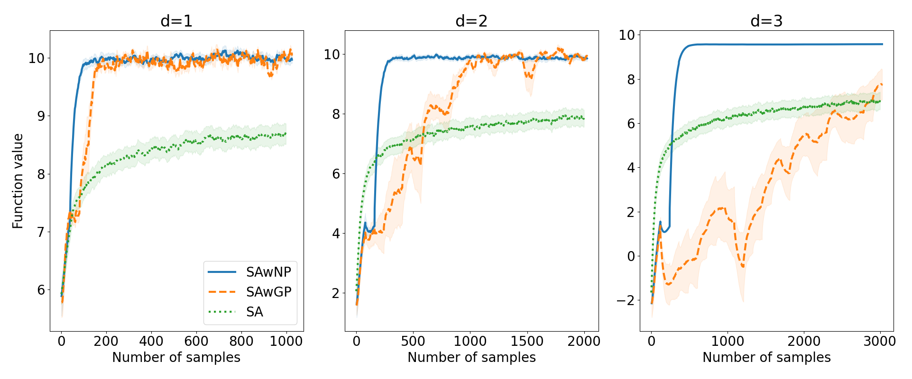

# SAwNP
The goal of this project is to use pre-trained ([attentive](https://arxiv.org/abs/1901.05761)) [neural processes](https://arxiv.org/abs/1807.01622) in place of gaussian process regression models to improve the convergence rate of Kiefer-Wolfowitz (KW) type stochastic approximation (SA) using the *stochastic approximation of gaussian process regression* ([SAwGP](https://ieeexplore.ieee.org/document/9715329)) framework.

# Results
Quadratic cost function with noise:
$$h(\mathbf{x}) = -0.05||\mathbf{x} - \mathbf{2}||^2 + 10, \quad \mathbf{x} \in \mathbb{X} := [-10, 10]^d$$

